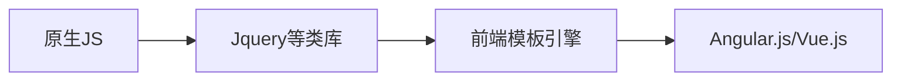
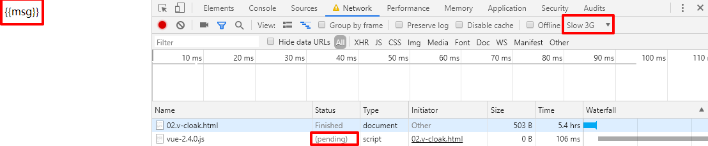
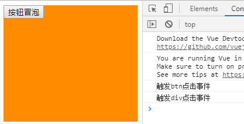
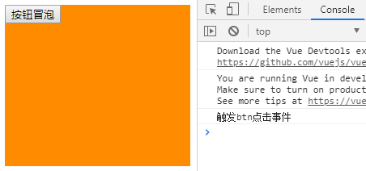
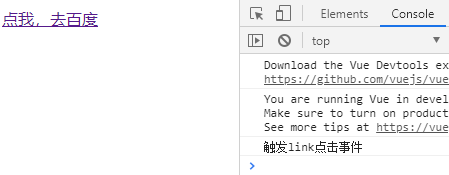
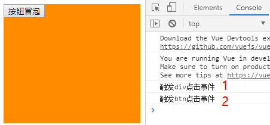
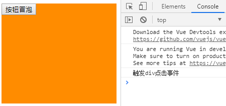
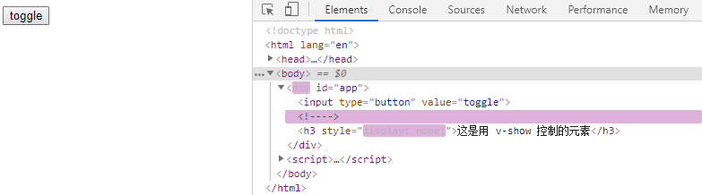

[TOC]

# 什么是Vue.js

- Vue.js 是目前最火的一个前端框架，React是最流行的一个前端框架（React除了开发网站，还可以开发手机App， Vue语法也是可以用于进行手机App开发的，需要借助于Weex）

- Vue.js 是前端的**主流框架之一**，和Angular.js、React.js 一起，并成为前端三大主流框架！
- Vue.js 是一套构建用户界面的框架，**只关注视图层**，它不仅易于上手，还便于与第三方库或既有项目整合。（Vue有配套的第三方类库，可以整合起来做大型项目的开发）
- 前端的主要工作？主要负责MVC中的V这一层；主要工作就是和界面打交道，来制作前端页面效果；

# 为什么要学习流行框架

- 提高开发效率的发展历程：原生JS -> Jquery之类的类库 -> 前端模板引擎 -> Angular.js / Vue.js（能够帮助我们减少不必要的DOM操作；提高渲染效率；双向数据绑定的概念【通过框架提供的指令，程序员只需要关心数据的业务逻辑，不再关心DOM是如何渲染的了】）



# 框架和库的区别

- 框架：是一套完整的解决方案；对项目的侵入性较大，项目如果需要更换框架，则需要重新架构整个项目。
- 库（插件）：提供某一个小功能，对项目的侵入性较小，如果某个库无法完成某些需求，可以很容易切换到其它库实现需求

# 后端中的 MVC 与 前端中的 MVVM 之间的区别

- MVC 是后端的分层开发概念
- MVVM是前端视图层的概念，主要关注于 视图层分离，也就是说：MVVM把前端的视图层，分为了 三部分 Model, View , VM ViewModel


# Vue指令

## `v-cloak`

- **不需要表达式**

- **用法**：

  这个指令保持在元素上直到关联实例结束编译。和 CSS 规则如 <font color=#e96900>` [v-cloak] { display: none } `</font> 一起用时，这个指令可以隐藏未编译的 Mustache 标签直到实例准备完毕。

- 用于避免网速过慢造成数据未加载情况



## `v-text`

- **预期**：`string`

- **详细**：

  更新元素的 <font color=#e96900>`textContent`</font>。如果要更新部分的 <font color=#e96900>`textContent`</font> ，需要使用 <font color=#e96900>`{{ Mustache }}`</font> 插值。

### `v-cloak` 与 `v-text` 的区别

- 默认 `v-text` 是没有闪烁问题
- `v-text` 会覆盖掉元素中原本的内容，但是 插值表达式 只会替换自己的占位符，不会把整个内容清空
- 都会把内容当作普通的文本输出

## `v-html`

- **预期**：`string`

- **详细**：

  更新元素的 <font color=#e96900>`innerHTML`</font> 。**注意：内容按普通 HTML 插入 - 不会作为 Vue 模板进行编译** 。

  如果试图使用 <font color=#e96900>`v-html`</font> 组合模板，可以重新考虑是否通过使用组件来替代。

## `v-bind`

*Vue 提供的属性绑定机制*

- **缩写**：<font color=#e96900>`:`</font>

- **用法**：

  动态地绑定一个或多个特性，或一个组件 prop 到表达式。

  在绑定 <font color=#e96900>`class`</font> 或 <font color=#e96900>`style`</font> 特性时，支持其它类型的值，如数组或对象。

  在绑定 prop 时，prop 必须在子组件中声明。可以用修饰符指定不同的绑定类型。

  没有参数时，可以绑定到一个包含键值对的对象。注意此时 <font color=#e96900>`class`</font> 和 <font color=#e96900>`style`</font> 绑定不支持数组和对象。

## `v-on`

*Vue 提供事件绑定机制*

- **缩写**：<font color=#e96900>`@`</font>

- **用法**：

  绑定事件监听器。事件类型由参数指定。表达式可以是一个方法的名字或一个内联语句，如果没有修饰符也可以省略。

  用在普通元素上时，只能监听**原生 DOM 事件**。用在自定义元素组件上时，也可以监听子组件触发的**自定义事件**。

  在监听原生 DOM 事件时，方法以事件为唯一的参数。如果使用内联语句，语句可以访问一个 <font color=#e96900>`$event`</font> 属性：<font color=#e96900>`v-on:click="handle('ok', $event)"`</font>。

  **事件修饰符**

  - <font color=#e96900>`.stop`</font> - 调用 <font color=#e96900>`event.stopPropagation()`</font> 阻止冒泡。

  ```html
  <div class="inner-div" @click="div_handle">
      <input type="button" value="按钮冒泡" @click="btn_handle">
  </div>
  ```

  点击按钮会出现冒泡事件

  

  ```html
  <div class="inner-div" @click="div_handle">
      <input type="button" value="按钮冒泡" @click.stop="btn_handle">
  </div>
  ```

  阻止冒泡事件

  

  - <font color=#e96900>`.prevent`</font> - 调用 <font color=#e96900>`event.preventDefault()`</font> 阻止默认事件。

  ```html
  <a href="http://www.baidu.com" @click.prevent="a_handle">点我，去百度</a>
  ```

  点击链接并没有进行跳转

  

  - <font color=#e96900>`.capture`</font> - 添加事件侦听器时使用 capture （事件捕获） 模式。

  ```html
  <div class="inner-div" @click.capture="div_handle">
      <input type="button" value="按钮冒泡" @click="btn_handle">
  </div>
  ```

  点击按钮从外往里进行事件触发

  

  - <font color=#e96900>`.self`</font> - 只当事件是从侦听器绑定的元素本身触发时才触发回调。

  ```html
  <div class="inner-div" @click.self="div_handle">
      <input type="button" value="按钮冒泡" @click="btn_handle">
  </div>
  ```

  点击div才会触发元素自身事件

  

  - <font color=#e96900>`.once`</font> - 只触发一次回调。

  ```html
  <a href="http://www.baidu.com" @click.prevent.once="a_handle">点我，去百度</a>
  ```

## `v-model`

- **用法**：

  在表单控件或者组件上创建双向绑定。

## `v-for`

### 用 `v-for` 把一个数组对应为一组元素

我们用 <font color=#e96900>`v-for`</font> 指令根据一组数组的选项列表进行渲染。<font color=#e96900>`v-for`</font> 指令需要使用 <font color=#e96900>`item in items`</font> 形式的特殊语法，<font color=#e96900>`items`</font> 是源数据数组并且 <font color=#e96900>`item`</font> 是数组元素迭代的别名。
*循环基本数组*
```html
<p v-for="(item, index) in items">索引：{{index}} -- 元素：{{item}}</p>
```

```js
var vm = new Vue({
    el: '#app',
    data: {
        items: [1, 2, 3, 4, 5]
    },
    methods: {}
})
```
*循环对象数组*
```html
<p v-for="(user, index) in users">id: {{user.id}} -- name: {{user.name}} -- index: {{index}}</p>
```

```js
var vm = new Vue({
    el: '#app',
    data: {
        users:[
            {id: 1, name: 'zs'},
            {id: 2, name: 'ls'},
            {id: 3, name: 'ww'},
            {id: 4, name: 'zl'},
        ]
    },
    methods: {}
})
```
### 一个对象的 `v-for`

也可以用 <font color=#e96900>`v-for`</font> 通过一个对象的属性来迭代。

第一个的参数为属性，第二个的参数为键名，第三个参数为索引。

```html
<p v-for="(val, key, index) in user" >值：{{val}} -- 键：{{key}} -- 索引：{{index}}</p>
```

```js
var vm = new Vue({
    el: '#app',
    data: {
        user:{
            id: 1,
            name: 'Tony Stark',
            gender: 'man'
        }
    },
    methods: {}
})
```
> 在遍历对象时，是按 `Object.keys()` 的结果遍历，但是不能保证它的结果在不同的 JavaScript 引擎下是一致的。
### 一段取值范围的 `v-for`

<font color=#e96900>`v-for`</font> 也可以取整数。在这种情况下，它将重复多次模板。

```html
<p v-for="count in 5" >第 {{count}} 次循环</p>
```

### <font color=#e96900>`key`</font>

当 Vue.js 用 `v-for` 正在更新已渲染过的元素列表时，它默认用“就地复用”策略。如果数据项的顺序被改变，Vue 将不会移动 DOM 元素来匹配数据项的顺序， 而是简单复用此处每个元素，并且确保它在特定索引下显示已被渲染过的每个元素。

这个默认的模式是高效的，但是只适用于**不依赖子组件状态或临时 DOM 状态 (例如：表单输入值) 的列表渲染输出**。

为了给 Vue 一个提示，以便它能跟踪每个节点的身份，从而重用和重新排序现有元素，你需要为每项提供一个唯一 <font color=#e96900>`key`</font> 属性。理想的 <font color=#e96900>`key`</font> 值是每项都有的唯一 id。

```html
<p v-for="item in list" :key="item.id">
    <input type="checkbox" name="" id="">
    {{item.id}} -- {{item.name}}
</p>
```

> 不要使用对象或数组之类的非原始类型值作为 <font color=#e96900>`v-for`</font> 的 <font color=#e96900>`key`</font>。用字符串或数类型的值取而代之。

## `v-if`

`v-if` 指令用于条件性地渲染一块内容。这块内容只会在指令的表达式返回 truthy 值的时候被渲染。

## `v-show`

另一个用于根据条件展示元素的选项是 `v-show` 指令。

```html
<div id="app">
    <input type="button" value="toggle" @click="flag=!flag">
    <h3 v-if="flag">这是用 v-if 控制的元素</h3>
    <h3 v-show="flag">这是用 v-show 控制的元素</h3>
</div>
```
不同的是带有 `v-show` 的元素始终会被渲染并保留在 DOM 中。`v-show` 只是简单地切换元素的 CSS 属性 `display`。



### v-if 和 v-show 比较

> `v-if` 是“真正”的条件渲染，因为它会确保在切换过程中条件块内的事件监听器和子组件适当地被销毁和重建。
>
> `v-if` 也是**惰性的**：如果在初始渲染时条件为假，则什么也不做——直到条件第一次变为真时，才会开始渲染条件块。
>
> 相比之下，`v-show` 就简单得多——不管初始条件是什么，元素总是会被渲染，并且只是简单地基于 CSS 进行切换。
>
> 一般来说，`v-if` 有更高的切换开销，而 `v-show` 有更高的初始渲染开销。因此，如果需要非常频繁地切换，则使用 `v-show` 较好；如果在运行时条件很少改变，则使用 `v-if` 较好。

`v-if` 也是**惰性的**：如果在初始渲染时条件为假，则什么也不做——直到条件第一次变为真时，才会开始渲染条件块。

相比之下，`v-show` 就简单得多——不管初始条件是什么，元素总是会被渲染，并且只是简单地基于 CSS 进行切换。

一般来说，`v-if` 有更高的切换开销，而 `v-show` 有更高的初始渲染开销。因此，如果需要非常频繁地切换，则使用 `v-show` 较好；如果在运行时条件很少改变，则使用 `v-if` 较好。

# 在 Vue 中使用样式

## 使用 class 样式

*数组语法*

我们可以把一个数组传给 <font color=#e96900>`v-bind:class`</font>，以应用一个 class 列表：

```html
<h1 :class="['red']">Look! Styles, Manipulate Text, Colors, Boxes and more...</h1>
```

如果你也想根据条件切换列表中的 class，可以用三元表达式：

```html
<h1 :class="['red', flag?'active':'']">Look! Styles, Manipulate Text, Colors, Boxes and more...</h1>
```

```js
var vm = new Vue({
    el: '#app',
    data: {
        flag: true
    },
    methods: {}
})
```

只有在 `isActive` 是 truthy[^1] 时才添加 `activeClass`。

不过，当有多个条件 class 时这样写有些繁琐。所以在数组语法中也可以使用对象语法：

```html
<h1 :class="['red', {'active':flag}]">Look! Styles, Manipulate Text, Colors, Boxes and more...
```
*对象语法*

我们可以传给 <font color=#e96900>`v-bind:class`</font> 一个对象，以动态地切换 class：

```html
<h1 :class="{red: true, thin: false, italic: true, active: false}">Look! Styles, Manipulate Text, Colors, Boxes and more...</h1>
```

绑定的数据对象不必内联定义在模板里：

```html
<h1 :class="classObj">Look! Styles, Manipulate Text, Colors, Boxes and more...</h1>
```

```js
var vm = new Vue({
    el: '#app',
    data: {
        classObj: {
            red: true,
            thin: false,
            italic: true,
            active: false
        }
    },
    methods: {}
})
```

## 使用 style 样式

**绑定内联样式**

*对象语法*

<font color=#e96900>`v-bind:style`</font> 的对象语法十分直观——看着非常像 CSS，但其实是一个 JavaScript 对象。CSS 属性名可以用驼峰式 (camelCase) 或短横线分隔 (kebab-case，记得用单引号括起来) 来命名：

```html
<h1 :style="{color:'red', 'font-weight':200}">Look! Styles, Manipulate Text, Colors, Boxes and more...</h1>
```

直接绑定到一个样式对象通常更好，这会让模板更清晰：

```html
<h1 :style="styleObj1">Look! Styles, Manipulate Text, Colors, Boxes and more...</h1>
```

```js
var vm = new Vue({
    el: '#app',
    data: {
        styleObj1: {color:'red', 'font-weight':200}
    },
    methods: {}
})
```

<font color=#e96900>`v-bind:style`</font> 的数组语法可以将多个样式对象应用到同一个元素上：

```html
<h1 :style="[styleObj1, styleObj2]">Look! Styles, Manipulate Text, Colors, Boxes and more...</h1>
```

```js
var vm = new Vue({
    el: '#app',
    data: {
        styleObj1: {color:'red', 'font-weight':200},
        styleObj2: {'font-style': 'italic'}
    },
    methods: {}
})
```

# 过滤器

Vue.js 允许你自定义过滤器，可被用于一些常见的文本格式化。过滤器可以用在两个地方：**双花括号插值和 v-bind 表达式** 。过滤器应该被添加在 JavaScript 表达式的尾部，由“管道”符号指示：

> 过滤器函数总接收表达式的值 (之前的操作链的结果) 作为第一个参数。
>
> 过滤器的 function ，第一个参数已经规定死了，永远是管道符前面传递过来的数据

过滤器是 JavaScript 函数，因此可以接收参数：

```html
<p>{{ message | filterA('arg1', arg2) }}</p>
```

这里，`filterA` 被定义为接收三个参数的过滤器函数。其中 `message` 的值作为第一个参数，普通字符串 `'arg1'` 作为第二个参数，表达式 `arg2` 的值作为第三个参数。

> 同名过滤器遵从<font color=#e96900>`就近原则`</font>， 私有过滤器 > 全局过滤器

## 全局过滤器

*在创建 Vue 实例之前全局定义过滤器*

所有的 vm 实例都共享

```js
// 全局过滤器，实现时间的格式化
// ** 在创建 Vue 实例之前定义全局过滤器
// pattern="" ES6 形参初始默认值，防止undefined情况
Vue.filter('dateFormat', function (dateStr, pattern="") {
    var dt = new Date(dateStr)
    // 手动拼接处 yyyy-mm-dd 格式
    var y = dt.getFullYear()
    var m = dt.getMonth() + 1 < 10 ? "0" + (dt.getMonth() + 1) : dt.getMonth() + 1;
    var d = dt.getDate() < 10 ? "0" + dt.getDate() : dt.getDate();
    // 返回模板字符串
    // return `${y}-${m}-${d}`

    if ('yyyy-mm-dd' === pattern.toLowerCase()) {
        return `${y}-${m}-${d}`
    }else {
        var hh = dt.getHours() < 10 ? "0" + dt.getHours() : dt.getHours();
        var mm = dt.getMinutes() < 10 ? "0" + dt.getMinutes() : dt.getMinutes();
        var ss = dt.getSeconds() < 10 ? "0" + dt.getSeconds() : dt.getSeconds();

        return `${y}-${m}-${d} ${hh}:${mm}:${ss}`
    }
})


new Vue({
  // ...
})
```

## 私有过滤器

*在一个组件的选项中定义本地的过滤器*

```html
<div id="app2">
    <h1 :style="{color:'red', 'font-style': 'italic'}">{{dt | dateFormat("yyyy-MM-dd")}}</h1>
</div>
```
> 根据给定长度自动在字符串的前面补充想补充的字符串（只返回修改后的字符串，不修改原字符串）
>
> str.padStart(targetLength [, padString])	从头添加
>
> str.padEnd(targetLength [, padString])	 从尾添加
```js
var vm2 = new Vue({
    el: '#app2',
    data:{
        dt: new Date()
    },
    methods: {},
    filters: {
        // 定义私有过滤器
        dateFormat: function (dateStr, pattern="") {
            var dt = new Date(dateStr)
            // 手动拼接处 yyyy-mm-dd 格式
            var y = dt.getFullYear();
            var m = (dt.getMonth() + 1).toString().padStart(2, '0');
            var d = dt.getDate().toString().padStart(2, '0');
            // 返回模板字符串
            // return `${y}-${m}-${d}`

            if ('yyyy-mm-dd' === pattern.toLowerCase()) {
                return `${y}-${m}-${d} ~~~~`
            }else {
                var hh = dt.getHours().toString().padStart(2, '0');
                var mm = dt.getMinutes().toString().padStart(2, '0');
                var ss = dt.getSeconds().toString().padStart(2, '0');

                return `${y}-${m}-${d} ${hh}:${mm}:${ss} ~~~~`
            }
        }
    }
})
```

# 按键修饰符

在监听键盘事件时，我们经常需要检查详细的按键。Vue 允许为 `v-on` 在监听键盘事件时添加按键修饰符：

```html
<label >
    Name:
    <input type="text" class="form-control" v-model="name" v-on:keyup.enter="add">
</label>
```

# 自定义指令

除了核心功能默认内置的指令 (`v-model` 和 `v-show`)，Vue 也允许注册自定义指令。注意，在 Vue2.0 中，代码复用和抽象的主要形式是组件。然而，有的情况下，你仍然需要对普通 DOM 元素进行底层操作，这时候就会用到自定义指令。

*全局指令*

```js
// 全局自定义指令
Vue.directive('focus', {
    // 当被绑定的元素插入到 DOM 中时
    inserted: function (el) {
        // 聚焦元素
        el.focus()
    }
})
```

*私有指令*

```js
directives: {
    // 自定义私有指令
    fw: {
        bind: function (el, binding) {
            el.style.fontWeight = binding.value
        }
    }
}
```


## 钩子函数

一个指令定义对象可以提供如下几个钩子函数 (均为可选)：

- <font color=#e96900>`bind`</font>：只调用一次，指令第一次绑定到元素时调用。在这里可以进行一次性的初始化设置。`运用到和样式有关`
- <font color=#e96900>`inserted`</font>：被绑定元素插入父节点时调用 (仅保证父节点存在，但不一定已被插入文档中)。`运用到和行为有关`
- `update`：所在组件的 VNode 更新时调用，**但是可能发生在其子 VNode 更新之前**。指令的值可能发生了改变，也可能没有。但是你可以通过比较更新前后的值来忽略不必要的模板更新。
- `componentUpdated`：指令所在组件的 VNode **及其子 VNode** 全部更新后调用。
- `unbind`：只调用一次，指令与元素解绑时调用。

## 钩子函数的参数

- <font color=#e96900>`el`</font>：指令所绑定的元素，可以用来直接操作 DOM 。

- <font color=#e96900>`binding`</font>：一个对象，包含以下属性：
  - <font color=#e96900>`name`</font>：指令名，不包括 `v-` 前缀。
  - <font color=#e96900>`value`</font>：指令的绑定值，例如：`v-my-directive="1 + 1"` 中，绑定值为 `2`。
  - `oldValue`：指令绑定的前一个值，仅在 `update` 和 `componentUpdated` 钩子中可用。无论值是否改变都可用。
  - <font color=#e96900>`expression`</font>：字符串形式的指令表达式。例如 `v-my-directive="1 + 1"`中，表达式为 `"1 + 1"`。
  - `arg`：传给指令的参数，可选。例如 `v-my-directive:foo` 中，参数为 `"foo"`。
  - `modifiers`：一个包含修饰符的对象。例如：`v-my-directive.foo.bar` 中，修饰符对象为 `{ foo: true, bar: true }`。

- `vnode`：Vue 编译生成的虚拟节点。移步 [VNode API](https://cn.vuejs.org/v2/api/#VNode-%E6%8E%A5%E5%8F%A3) 来了解更多详情。

- `oldVnode`：上一个虚拟节点，仅在 `update` 和 `componentUpdated` 钩子中可用。

# 生命周期


# 动画

Vue 在插入、更新或者移除 DOM 时，提供多种不同方式的应用过渡效果。

## 单元素/组件的过渡

Vue 提供了 <font color=#e96900>`transition`</font> 的封装组件，在下列情形中，可以给任何元素和组件添加进入/离开过渡

- 条件渲染 (使用 `v-if`)
- 条件展示 (使用 `v-show`)
- 动态组件
- 组件根节点

当插入或删除包含在 <font color=#e96900>`transition`</font> 组件中的元素时，Vue 将会做以下处理：

1. 自动嗅探目标元素是否应用了 CSS 过渡或动画，如果是，在恰当的时机添加/删除 CSS 类名。
2. 如果过渡组件提供了 JavaScript 钩子函数，这些钩子函数将在恰当的时机被调用。
3. 如果没有找到 JavaScript 钩子并且也没有检测到 CSS 过渡/动画，DOM 操作 (插入/删除) 在下一帧中立即执行。(注意：此指浏览器逐帧动画机制，和 Vue 的 `nextTick` 概念不同)

## 过渡类名


在进入/离开的过渡中，会有 6 个 class 切换。

1. <font color=#e96900>`v-enter`</font>：定义进入过渡的开始状态。在元素被插入之前生效，在元素被插入之后的下一帧移除。
2. <font color=#e96900>`v-enter-active`</font>：定义进入过渡生效时的状态。在整个进入过渡的阶段中应用，在元素被插入之前生效，在过渡/动画完成之后移除。这个类可以被用来定义进入过渡的过程时间，延迟和曲线函数。
3. <font color=#e96900>`v-enter-to`</font>: 定义进入过渡的结束状态。在元素被插入之后下一帧生效 (与此同时 <font color=#e96900>`v-enter`</font> 被移除)，在过渡/动画完成之后移除。
4. <font color=#e96900>`v-leave`</font>: 定义离开过渡的开始状态。在离开过渡被触发时立刻生效，下一帧被移除。
5. <font color=#e96900>`v-leave-active`</font>：定义离开过渡生效时的状态。在整个离开过渡的阶段中应用，在离开过渡被触发时立刻生效，在过渡/动画完成之后移除。这个类可以被用来定义离开过渡的过程时间，延迟和曲线函数。
6. <font color=#e96900>`v-leave-to`</font>: 定义离开过渡的结束状态。在离开过渡被触发之后下一帧生效 (与此同时 <font color=#e96900>`v-leave`</font> 被删除)，在过渡/动画完成之后移除。

对于这些在过渡中切换的类名来说，如果你使用一个没有名字的 `<transition>`，则 `v-` 是这些类名的默认前缀。如果你使用了 `<transition name="my-transition">`，那么 `v-enter` 会替换为 `my-transition-enter`。

```html
<div id="app">
    <input type="button" value="toggle" @click="show = !show">
    <!-- 使用 transition 包裹元素 -->
    <transition>
        <h3 v-if="show">Look! Styles, Manipulate Text, Colors, Boxes and more...</h3>
    </transition>
</div>
```

```css
    <style>
        /* 自定义两组样式来控制 transition 内部元素实现的动画*/
        /* v-enter [时间点] 进入之前元素的起始位置，此时还没有开始进入 */
        /* v-leave-to [时间点] 元素离开之后，最终的结束状态 */
        .v-enter,
        .v-leave-to{
            opacity: 0;
        }
        /* v-enter-active [时间段] 应用在整个进入过渡的过程中 */
        /* v-leave-active [时间段] 应用在整个离开过渡的过程中 */
        .v-enter-active,
        .v-leave-active{
            transition: all .5s ease;
        }
    </style>
```

## 列表过渡

那么怎么同时渲染整个列表，比如使用 `v-for` ？在这种场景中，使用 <font color=#e96900>`<transition-group>`</font> 组件。在我们深入例子之前，先了解关于这个组件的几个特点：

- 不同于 `<transition>`，它会以一个真实元素呈现：默认为一个 `<span>`。你也可以通过 `tag` 特性更换为其他元素。
- 过渡模式不可用，因为我们不再相互切换特有的元素。
- 内部元素 **总是需要** 提供唯一的 `key` 属性值。

# 组件

## 定义Vue组件

> 什么是组件： 组件的出现，就是为了拆分Vue实例的代码量的，能够让我们以不同的组件，来划分不同的功能模块，将来我们需要什么样的功能，就可以去调用对应的组件即可；
>
> 组件化和模块化的不同：
>
> - 模块化： 是从代码逻辑的角度进行划分的；方便代码分层开发，保证每个功能模块的职能单一；
> - 组件化： 是从UI界面的角度进行划分的；前端的组件化，方便UI组件的重用；

## 全局组件的三种定义

1. 使用 Vue.extend 配合 Vue.component 方法：

   ```js
   // 1.1 使用 Vue.extend 来创建全局 Vue 组件
   var com1 = Vue.extend({
       // 通过 template 属性，指定了组件要展示的 HTML 结构
       template: '<h3>Vue.extend 创建的组件</h3>'
   })
   // 1.2 使用 Vue.component
   Vue.component('myCom1', com1)
   ```

   ```html
   <div id="app">
       <!-- 1.3 使用组件，将组件名称以 HTML 标签的形式引入（** 驼峰命名 改为 -）到页面中 -->
       <my-com1></my-com1>
   </div>
   ```

   

**译者注**

[^1]: truthy 不是 `true`，详见 [MDN](https://developer.mozilla.org/zh-CN/docs/Glossary/Truthy) 的解释。 