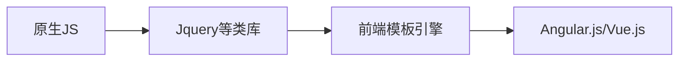

# 什么是Vue.js

- Vue.js 是目前最火的一个前端框架，React是最流行的一个前端框架（React除了开发网站，还可以开发手机App， Vue语法也是可以用于进行手机App开发的，需要借助于Weex）

- Vue.js 是前端的**主流框架之一**，和Angular.js、React.js 一起，并成为前端三大主流框架！
- Vue.js 是一套构建用户界面的框架，**只关注视图层**，它不仅易于上手，还便于与第三方库或既有项目整合。（Vue有配套的第三方类库，可以整合起来做大型项目的开发）
- 前端的主要工作？主要负责MVC中的V这一层；主要工作就是和界面打交道，来制作前端页面效果；

# 为什么要学习流行框架

- 提高开发效率的发展历程：原生JS -> Jquery之类的类库 -> 前端模板引擎 -> Angular.js / Vue.js（能够帮助我们减少不必要的DOM操作；提高渲染效率；双向数据绑定的概念【通过框架提供的指令，程序员只需要关心数据的业务逻辑，不再关心DOM是如何渲染的了】）

# 框架和库的区别

- 框架：是一套完整的解决方案；对项目的侵入性较大，项目如果需要更换框架，则需要重新架构整个项目。
- 库（插件）：提供某一个小功能，对项目的侵入性较小，如果某个库无法完成某些需求，可以很容易切换到其它库实现需求

# 后端中的 MVC 与 前端中的 MVVM 之间的区别

- MVC 是后端的分层开发概念
- MVVM是前端视图层的概念，主要关注于 视图层分离，也就是说：MVVM把前端的视图层，分为了 三部分 Model, View , VM ViewModel

# Vue指令

## `v-cloak`

- **不需要表达式**

- **用法**：

  这个指令保持在元素上直到关联实例结束编译。和 CSS 规则如 ` [v-cloak] { display: none } ` 一起用时，这个指令可以隐藏未编译的 Mustache 标签直到实例准备完毕。

- 用于避免网速过慢造成数据未加载情况

## `v-text`

- **预期**：`string`

- **详细**：

  更新元素的 `textContent`。如果要更新部分的 `textContent` ，需要使用 `{{ Mustache }}` 插值。

### `v-cloak` 与 `v-text` 的区别

- 默认 `v-text` 是没有闪烁问题
- `v-text` 会覆盖掉元素中原本的内容，但是 插值表达式 只会替换自己的占位符，不会把整个内容清空
- 都会把内容当作普通的文本输出

## `v-html`

- **预期**：`string`

- **详细**：

  更新元素的 `innerHTML` 。**注意：内容按普通 HTML 插入 - 不会作为 Vue 模板进行编译** 。

  如果试图使用 `v-html` 组合模板，可以重新考虑是否通过使用组件来替代。

## `v-bind`

- **缩写**：`:`

- **预期**：`any (with argument) | Object (without argument)`

